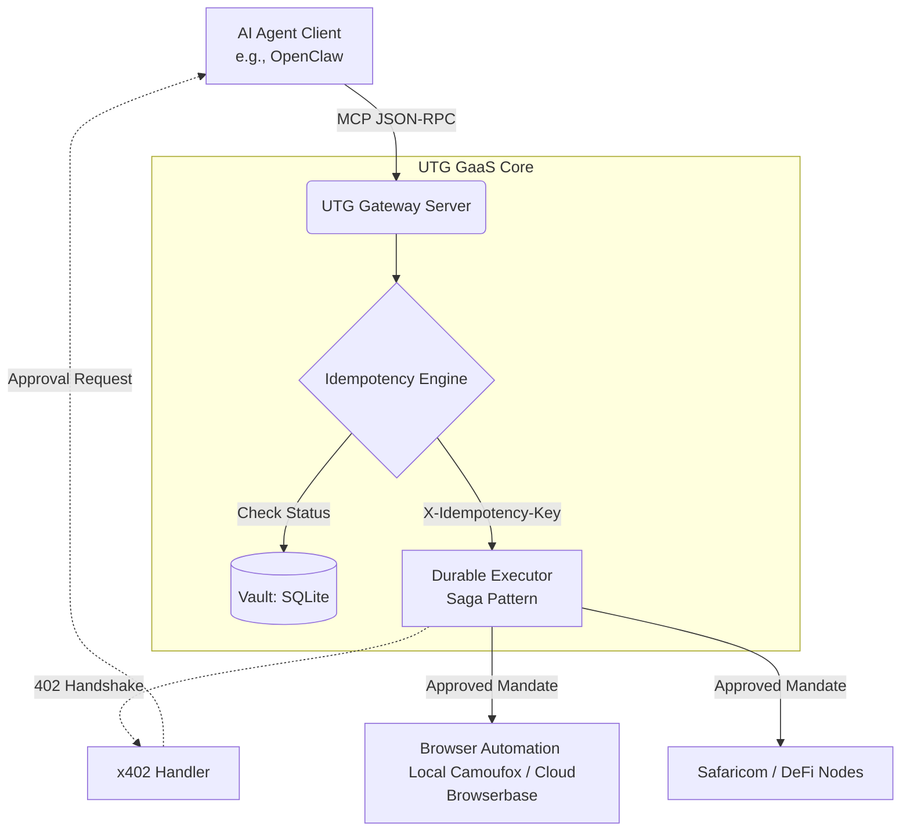

<h1 align="center">
  🏦 UTG GaaS: Universal Transaction Gateway
</h1>

<p align="center">
  <strong>The Programmable Settlement Layer for the AI Agent Economy.</strong><br>
  <em>Powered by the Eva Protocol Stack (v2.0)</em>
</p>

<p align="center">
  <a href="https://opensource.org/licenses/MIT"></a>
  <a href="https://www.python.org/downloads/release/python-3110/"></a>
  <a href="https://modelcontextprotocol.io/"></a>
  <a href="CODE_OF_CONDUCT.md"></a>
</p>

---

## 🌟 Overview

**UTG GaaS** is a Model Context Protocol (MCP) server that acts as a secure financial bridge between AI Agents (like OpenClaw or Claude Desktop) and the real-world economy. 

It provides a high-consistency, non-custodial gateway for executing DeFi trades, automated e-commerce, and M-Pesa transactions. By adhering to the **Eva Protocol Stack** and **x402 Payment Specifications**, UTG natively supports autonomous, agent-to-agent negotiations while keeping the human user safely in the loop.

---

## 🏗️ Architecture: The Eva Protocol Stack



---

## 🛡️ Core Features

*   **Consistency (CP) Over Availability**: Driven by the `IdempotencyManager`, the gateway prevents "Double-Spend" catastrophes. If a network flickers, the system locks state rather than executing a duplicate transaction.
*   **x402 Protocol Support**: Full compliance with the `HTTP 402` "Payment Required" standard, allowing agents to solve paywalls mid-reasoning.
*   **Durable Sagas**: Executes multi-step workflows (e.g., *M-Pesa -> Stablecoin Swap -> Transfer*) with automated compensating rollbacks if any step fails.
*   **Non-Custodial Design**: Uses an MPC-style "Signature Share" handshake. The gateway simulates transactions but never controls your full private keys.
*   **Cryptographic Audit Vault**: Every transaction generates a legally verifiable, Ed25519-signed PDF statement.

---

## 🚀 Quick Start (Zero-Code)

We prioritize a developer-friendly onboarding experience.

### 1. Installation
Install the gateway globally via `pip` or `Make`:
```bash
# Using Make
make install

# OR using Pip directly
pip install .
```

### 2. The Onboarding Wizard
Run the interactive wizard to generate your cryptographic identity and setup your environment securely:
```bash
utg-onboard
```

### 3. Connect to your Agent
The wizard will output an MCP configuration snippet. Paste it into your OpenClaw or Claude Desktop configuration:
```json
"mcpServers": {
  "utg-gateway": {
    "command": "python",
    "args": ["/absolute/path/to/universal-transaction-gateway/src/gateway/server.py"]
  }
}
```

---

## 📚 Official Documentation

Explore the full potential of the Universal Transaction Gateway on our [Documentation Portal](docs_site/index.html) (hosted seamlessly on Vercel at `utg.useaima.com`).

*   **[Installation Details](docs_site/index.html#installation)**: Platform-specific guides (macOS, Windows, Linux).
*   **[Tool Reference](docs_site/index.html#api)**: Detailed MCP tool schemas.

---

## 🤝 Contributing

We welcome contributions from the open-source community to advance the Agentic Economy! 

Please review our [Contributing Guidelines](CONTRIBUTING.md) to get started. Be sure to check our issue templates for bug reports and feature requests. We expect all contributors to adhere to our [Code of Conduct](CODE_OF_CONDUCT.md).

## 🔒 Security

For responsible disclosure of vulnerabilities, please see our [Security Policy](SECURITY.md).

---

## 📄 License

This software is released under the [MIT License](LICENSE).
