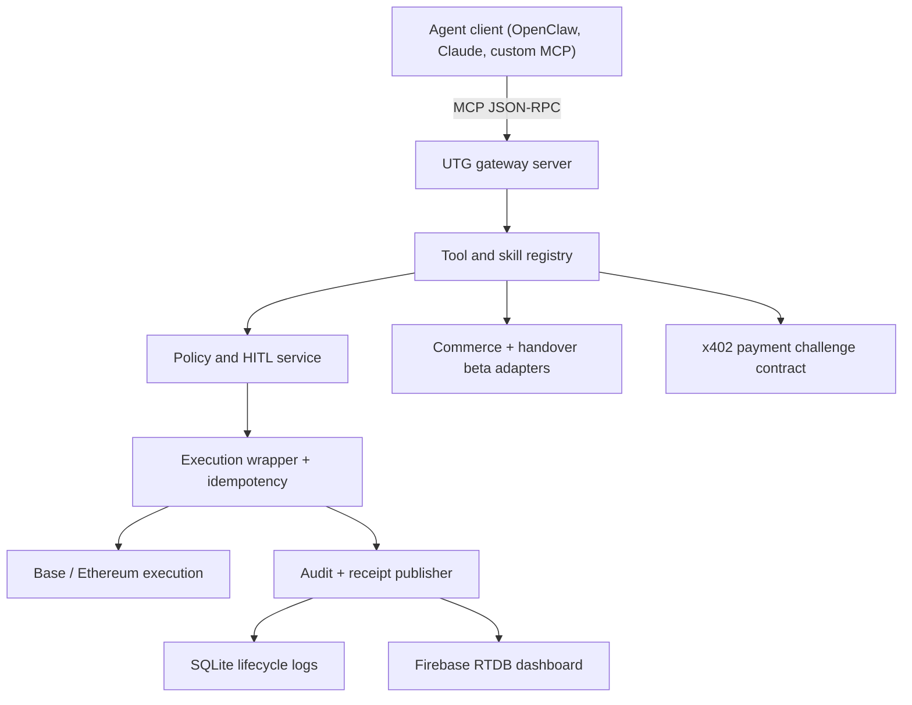

# Universal Transaction Gateway

UTG is an open-source, self-hosted MCP gateway for agentic finance.

It sits between an agent and real-value execution so operators can connect OpenClaw, Claude Desktop, Telegram-driven workflows, or custom MCP clients without handing raw wallet custody to the model. Base and Ethereum are the first-class execution rails today. Human-in-the-loop approval is always enforced for value-moving actions.

[](https://choosealicense.com/licenses/mit/)
[]()
[]()

## What UTG is

- An MCP-first gateway for agent-triggered finance
- A non-custodial control layer with approval interrupts
- A Base/Ethereum execution wrapper with replay protection
- A live operations surface backed by Firebase telemetry
- An open-source runtime you can wire into your own agent stack

## Support Matrix

| Tier | What real users can rely on today |
| --- | --- |
| `stable` | Base and Ethereum transfers, HITL approval enforcement, MCP integration, dashboard telemetry, idempotent retries |
| `beta` | Commerce search and browser-assisted checkout handover when the operator configures the required provider adapters |
| `experimental` | M-Pesa and fiat-adjacent payment rails until provider credentials, signed callbacks, and webhook runbooks are fully hardened |

## Product Contract

UTG is described the same way across the codebase, docs, and raw skill artifact:

- **Launch model:** open-source, self-hosted first
- **Primary user path:** MCP integration for OpenClaw and custom agents
- **Operator channels:** Telegram, Slack, TUI chat, or other surfaces layered on top of the gateway
- **Execution rails:** Base and Ethereum are executable; Bitcoin and Solana are observer/read-only networks for now
- **HITL invariant:** any value-moving action can pause for operator approval; the gateway never weakens this rule

## Architecture



## Quick Start

### 1. Install

```bash
pip install .
```

For local development:

```bash
pip install -e .
```

### 2. Create an operator config

Run the onboarding wizard:

```bash
utg-onboard
```

At minimum, stable Base/Ethereum usage should end up with:

```bash
GATEWAY_PASSCODE=...
SIWE_NONCE_SECRET=...
UTG_STORAGE_DIR=/srv/utg/storage
UTG_IDENTITY_KEY_PATH=/srv/utg/identity/gateway_ed25519.pem
BASE_PRIVATE_KEY=0x...
ETHEREUM_PRIVATE_KEY=0x...
BASE_RPC_URL=https://mainnet.base.org
ETHEREUM_RPC_URL=https://mainnet.gateway.tenderly.co/public
TREASURY_ADDRESS=0x...
AIMA_API_KEY=...
```

### 3. Validate the deployment profile

```bash
python src/gateway/utils/setup_validator.py
```

This checks the repo against the same support tiers documented in the docs site:

- `stable`: gateway passcode, SIWE nonce secret, externalized runtime storage, treasury, Base/Ethereum RPCs
- `beta`: commerce provider plus browser handover adapter
- `experimental`: M-Pesa provider credentials and callback routing

### 4. Start the gateway

```bash
python src/gateway/server.py
```

For production, keep `UTG_STORAGE_DIR` and `UTG_IDENTITY_KEY_PATH` outside the git checkout so runtime databases,
exports, and identity material never land in tracked source paths.

### 5. Connect an MCP client

OpenClaw, Claude Desktop, or any custom MCP client can connect over stdio:

```json
{
  "mcpServers": {
    "utg-gateway": {
      "command": "python",
      "args": ["/absolute/path/to/universal-transaction-gateway/src/gateway/server.py"],
      "env": {
        "AIMA_API_KEY": "...",
        "BASE_RPC_URL": "...",
        "ETHEREUM_RPC_URL": "...",
        "TREASURY_ADDRESS": "0x..."
      }
    }
  }
}
```

## Real User Flows

### OpenClaw or custom MCP agent

1. The agent calls `request_eth_transfer_reliable`
2. UTG halts the transfer under HITL
3. The operator provides the gateway passcode in their chosen chat or TUI surface
4. The agent calls `submit_signature_share`
5. The original transfer is retried with the same request, and the gateway resumes safely

### x402-paid service

1. The agent hits a payment-required boundary
2. UTG returns a canonical x402 challenge contract
3. The agent or operator settles the payment proof
4. The original request is retried with the same idempotency context

### Commerce beta

1. The agent calls `search_and_compare`
2. UTG checks whether a commerce provider is configured
3. If the provider is missing, the tool fails clearly instead of inventing results
4. If configured, the operator can continue into `request_order`, which routes to a browser handover workflow

## Public MCP Surface

Current public tools:

- `request_eth_transfer_reliable`
- `search_and_compare`
- `request_order`
- `request_human_handover`
- `submit_signature_share`
- `get_a2a_agent_card`

Backward compatibility note: tool names stay stable in v1 so existing OpenClaw or custom-agent configs do not break during internal refactors.

## Security Posture

- `SIWE_NONCE_SECRET` is required for wallet-sign-in nonce issuance and verification
- SIWE nonces are stored server-side, expire quickly, and are consumed exactly once
- `GATEWAY_PASSCODE` must be explicitly configured; there is no production fallback passcode
- `UTG_STORAGE_DIR` should point outside the repository so approval state, audit logs, and exports are never committed
- `UTG_IDENTITY_KEY_PATH` or `UTG_IDENTITY_PRIVATE_KEY_PEM` should be configured explicitly for the gateway identity
- Firebase Admin credentials stay server-side; browser bundles only receive public Firebase config
- GitHub guardrails now include CodeQL, secret scanning, dependency audits, SBOM generation, and README/docs/runtime contract assertions

## Docs

The canonical docs experience lives at:

- [utg.useaima.com/docs](https://utg.useaima.com/docs)
- Raw agent contract: [utg.useaima.com/docs/skill.md](https://utg.useaima.com/docs/skill.md)
- Sanitized flowcharts: [utg.useaima.com/docs/utg_flowcharts.md](https://utg.useaima.com/docs/utg_flowcharts.md)

The docs site covers:

- support matrix
- self-hosting and environment setup
- OpenClaw integration
- custom MCP agent integration
- Telegram and operator-channel patterns
- Base payments and x402
- contract deployment
- commerce automation and browser handover prerequisites
- M-Pesa experimental setup

## Base and Ethereum

UTG is designed to work well with a Base-first product strategy:

- Base and Ethereum are the stable execution rails
- Base user payments and x402 service payments can coexist
- The gateway remains the policy and approval boundary rather than becoming a custodial wallet

## Contributing

Contributions are welcome. The easiest way to help is to improve the stable operator path, strengthen tests around approval and retries, or harden provider-backed beta surfaces.

Please review:

- [CONTRIBUTING.md](CONTRIBUTING.md)
- [SECURITY.md](SECURITY.md)
- [CODE_OF_CONDUCT.md](CODE_OF_CONDUCT.md)

## License

[MIT](LICENSE)
