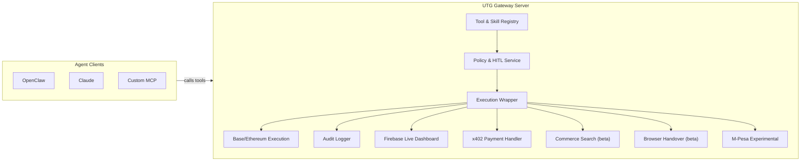
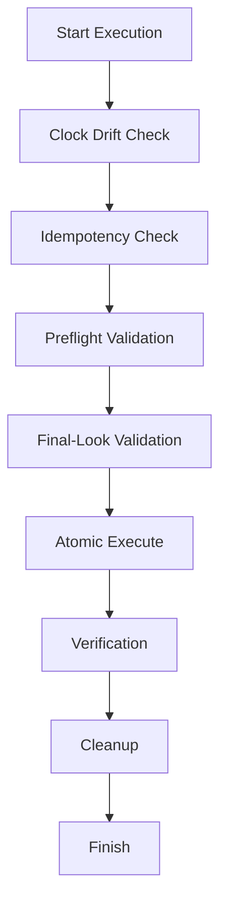
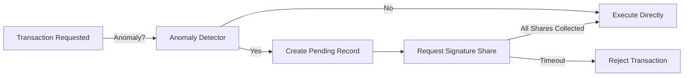
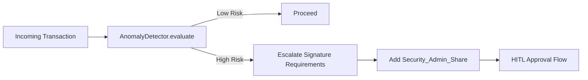
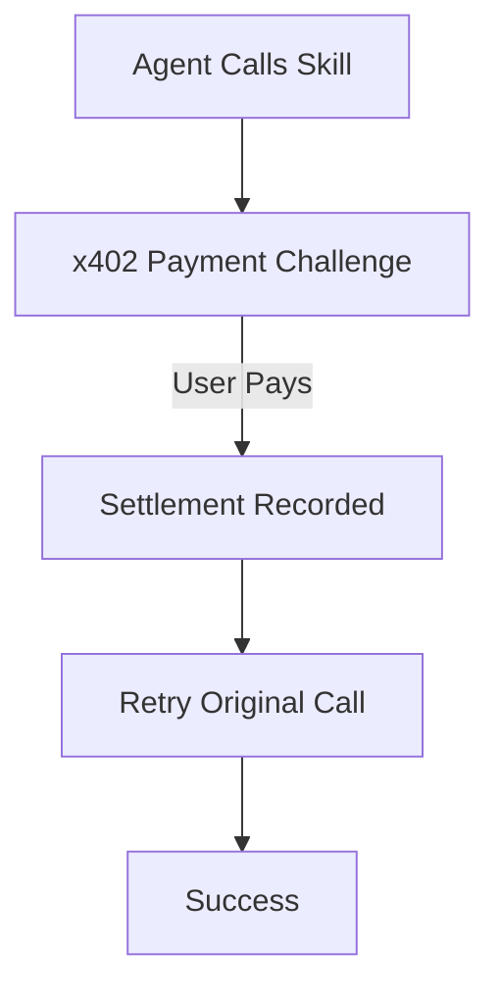
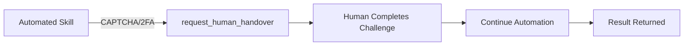
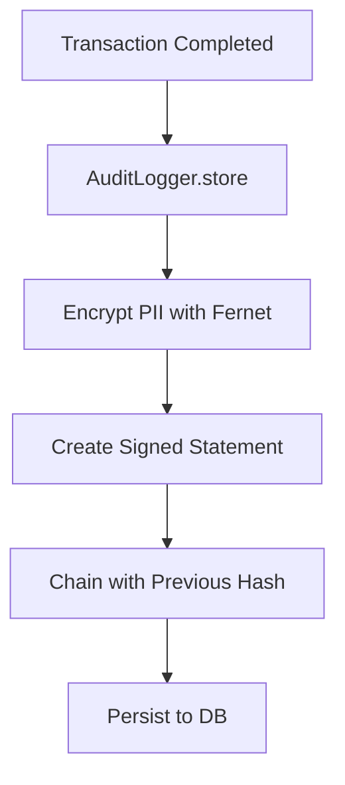
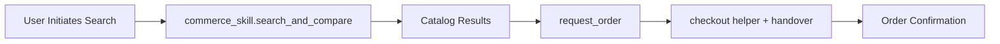
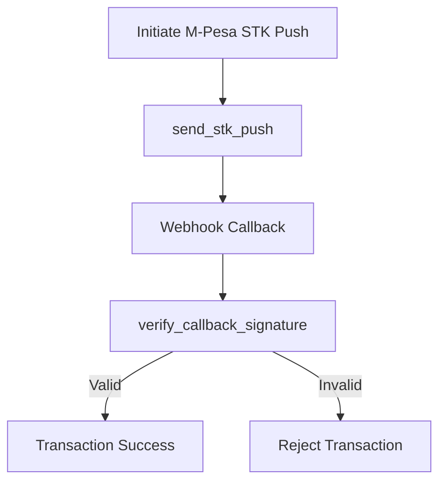
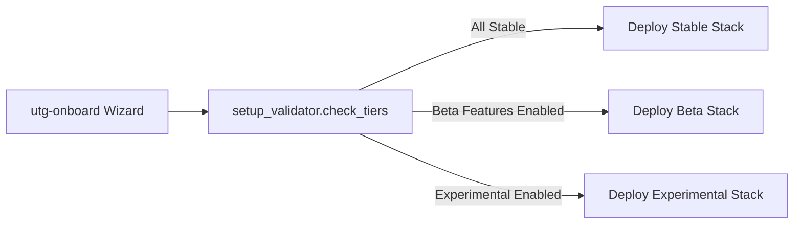

# Universal Transaction Gateway (UTG) Flowcharts

These diagrams are sanitized repo-local copies of the operator flowcharts used in the docs experience. They avoid local `file:///...` references and point only to checked-in Mermaid or repo-hosted assets.

## 1. High-Level System Architecture

## 2. Fortified Execution Lifecycle

## 3. Human-In-The-Loop (HITL) Multi-Share Approval

## 4. AI-Driven Anomaly Detection & Escalation

## 5. x402 Payment-Required Handshake

## 6. Browser Handover & 2FA Takeover

## 7. Cryptographic Audit Vault Flow

## 8. Beta Commerce Search & Checkout Path

## 9. Experimental M-Pesa STK Push Flow

## 10. Deployment Onboarding & Support Tier Validation

